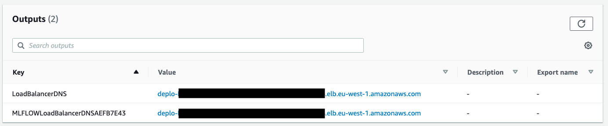
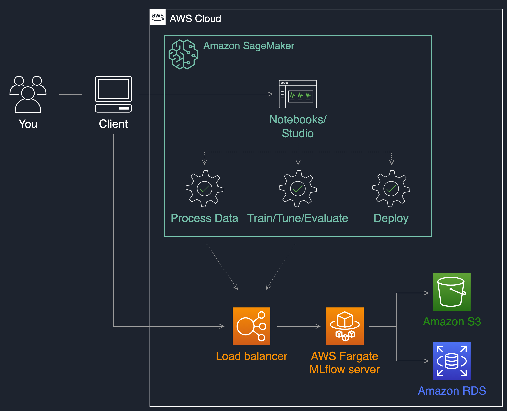

## Manage your machine learning lifecycle with MLflow and Amazon SageMaker

### Overview

In this repository we show how to deploy MLflow on AWS Fargate and how to use it during your ML project
with [Amazon SageMaker](https://aws.amazon.com/sagemaker). You will use Amazon SageMaker to develop, train, tune and
deploy a Scikit-Learn based ML model (Random Forest) and track experiment runs and models with MLflow.

This implementation shows how to do the following:

* Host a serverless MLflow server on AWS Fargate with S3 as artifact store and RDS and backend stores
* Track experiment runs running on SageMaker with MLflow
* Register models trained in SageMaker in the MLflow model registry
* Deploy an MLflow model into a SageMaker endpoint

### MLflow tracking server
You can set a central MLflow tracking server during your ML project. By using this remote MLflow server, data scientists
will be able to manage experiments and models in a collaborative manner.
An MLflow tracking server also has two components for storage: a ```backend store``` and an ```artifact store```. This
implementation uses an Amazon S3 bucket as artifact store and an Amazon RDS instance for MySQL as backend store.


### Prerequisites

We will use [the AWS CDK](https://cdkworkshop.com/) to deploy the MLflow server.

To go through this example, make sure you have the following:
* An AWS account where the service will be deployed
* [AWS CDK installed and configured](https://docs.aws.amazon.com/cdk/latest/guide/getting_started.html). Make sure to have the credentials and permissions to deploy the stack into your account
* [Docker](https://www.docker.com) to build and push the MLflow container image to ECR
* This [Github repository](https://github.com/aws-samples/amazon-sagemaker-mlflow-fargate) cloned into your environment to follow the steps

### Deploying the stack

You can view the CDK stack details in [app.py](https://github.com/aws-samples/amazon-sagemaker-mlflow-fargate/blob/main/app.py).
Execute the following commands to install CDK and make sure you have the right dependencies:

```
npm install -g aws-cdk@2.51.1
python3 -m venv .venv
source .venv/bin/activate
pip3 install -r requirements.txt
```

Once this is installed, you can execute the following commands to deploy the inference service into your account:

```
ACCOUNT_ID=$(aws sts get-caller-identity --query Account | tr -d '"')
AWS_REGION=$(aws configure get region)
cdk bootstrap aws://${ACCOUNT_ID}/${AWS_REGION}
cdk deploy --parameters ProjectName=mlflow --require-approval never
```

The first 2 commands will get your account ID and current AWS region using the AWS CLI on your computer. ```cdk
bootstrap``` and ```cdk deploy``` will build the container image locally, push it to ECR, and deploy the stack. 

The stack will take a few minutes to launch the MLflow server on AWS Fargate, with an S3 bucket and a MySQL database on
RDS. You can then use the load balancer URI present in the stack outputs to access the MLflow UI:



**N.B:** In this illustrative example stack, the load balancer is launched on a public subnet and is internet facing.
For security purposes, you may want to provision an internal load balancer in your VPC private subnets where there is no
direct connectivity from the outside world. Here is a blog post explaining how to achieve
this: [Access Private applications on AWS Fargate using Amazon API Gateway PrivateLink](https://aws.amazon.com/blogs/compute/access-private-applications-on-aws-fargate-using-amazon-api-gateway-privatelink/)

### Managing an ML lifecycle with Amazon SageMaker and MLflow

You now have a remote MLflow tracking server running accessible through
a [REST API](https://mlflow.org/docs/latest/rest-api.html#rest-api) via
the [load balancer uri](https://mlflow.org/docs/latest/quickstart.html#quickstart-logging-to-remote-server). 
You can use the MLflow Tracking API to log parameters, metrics, and models when running your machine learning project with Amazon
SageMaker. For this you will need install the MLflow library when running your code on Amazon SageMaker and set the
remote tracking uri to be your load balancer address.

The following python API command allows you to point your code executing on SageMaker to your MLflow remote server:

```
import mlflow
mlflow.set_tracking_uri('<YOUR LOAD BALANCER URI>')
```

Connect to your notebook instance and set the remote tracking URI.


### Running an example lab

This describes how to develop, train, tune and deploy a Random Forest model using Scikit-learn with
the [SageMaker Python SDK](https://sagemaker.readthedocs.io/en/stable/frameworks/sklearn/using_sklearn.html). We use
the [Boston Housing dataset](https://scikit-learn.org/stable/datasets/index.html#boston-dataset), present
in [Scikit-Learn](https://scikit-learn.org/stable/index.html.), and log our machine learning runs into MLflow. You can
find the original lab in
the [SageMaker Examples](https://github.com/aws/amazon-sagemaker-examples/tree/fb04396d2e7ceeb135b0b0a516e54c97922ca0d8/sagemaker-python-sdk/scikit_learn_randomforest)
repository for more details on using custom Scikit-learn scipts with Amazon SageMaker.

Follow the step-by-step guide by executing the notebooks in the following folders:

* lab/1_track_experiments.ipynb
* lab/2_track_experiments_hpo.ipynb
* lab/3_deploy_model.ipynb

### Current limitation on user access control

The [open source version](https://github.com/mlflow/mlflow) of MLflow does not currently provide user access control
features in case you have multiple tenants on your MLflow server. This means any user having access to the MLflow server
can modify experiments, model versions, and stages. This can be a challenge for enterprises in regulated industries that
need to keep strong model governance for audit purposes.

### Security

See [CONTRIBUTING](CONTRIBUTING.md#security-issue-notifications) for more information.

### License

This library is licensed under the MIT-0 License. See the LICENSE file.

